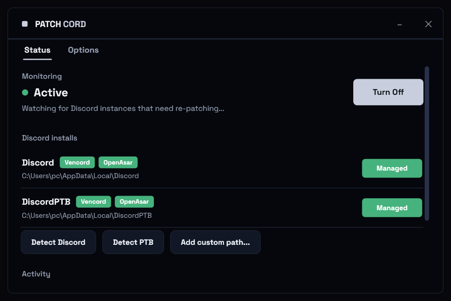
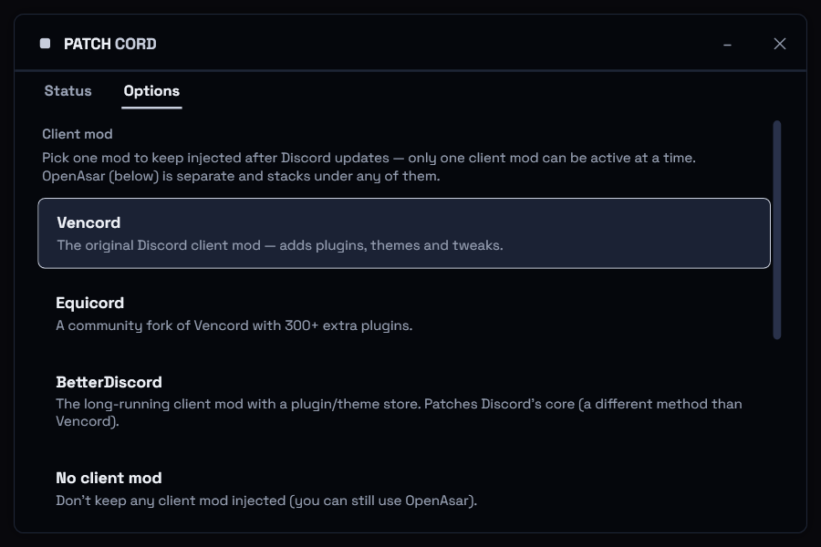

<p align="center"></p>
<h1 align="center">PatchCord</h1>

Keeps your Discord client mod installed. Discord wipes client mods every time it
auto-updates; PatchCord sits in the tray, notices when an install is running
unpatched, re-applies your mod, and restarts Discord.

Works with Vencord, Equicord, and BetterDiscord (pick one in Options). OpenAsar can
be kept installed alongside any of them.

## Screenshots

| Status | Options |
|--------|---------|
|  |  |

## How it works

It reproduces what each mod's installer does, then re-does it after an update wipes it:

- Vencord / Equicord: rename `resources\app.asar` to `_app.asar` and write a small
  stub `app.asar` that requires the mod's `dist\patcher.js`.
- BetterDiscord: overwrite `modules\discord_desktop_core\index.js` so it requires
  `%APPDATA%\BetterDiscord\data\betterdiscord.asar`.

It reuses the files each mod already put on disk, so there's nothing to download for
the mods themselves. If the mod you picked isn't installed, PatchCord leaves Discord
alone and shows a button to that mod's installer.

OpenAsar is optional and off by default. When on, it's downloaded from OpenAsar's
GitHub releases (cached locally) and re-applied under whichever mod you use.

## Install

Download `PatchCord.exe` from [Releases](https://github.com/tomgks/PatchCord/releases/latest)
and run it. That's all — it lives in the tray and keeps your mod patched. To have it
open automatically when you sign in to Windows, turn on **Run at startup** in the
Options tab.

## Build

Needs the [.NET 10 SDK](https://dotnet.microsoft.com/download). From the repo root:

```powershell
powershell -ExecutionPolicy Bypass -File publish.ps1
```

This writes a self-contained `publish\PatchCord.exe` (~66 MB) that runs without a
separate .NET install. For development: `dotnet build src`, or run
`PatchCord.exe --selftest` to build the UI and exit.

## Notes

- Windows only.
- Idle CPU is near zero; resident memory is the usual WPF range (~120-210 MB).
- `config.json` and `patchcord.log` are written next to the exe (not tracked in git).

## Credits

The asar patch and OpenAsar logic are ported from the
[Vencord Installer](https://github.com/Vencord/Installer); the BetterDiscord injection
from BetterDiscord's `scripts/inject.ts`. PatchCord is not affiliated with Vencord,
Equicord, BetterDiscord, or OpenAsar. OpenAsar is by GooseMod (AGPL-3.0); use it at
your own risk.

GPL-3.0. See [LICENSE](LICENSE).
